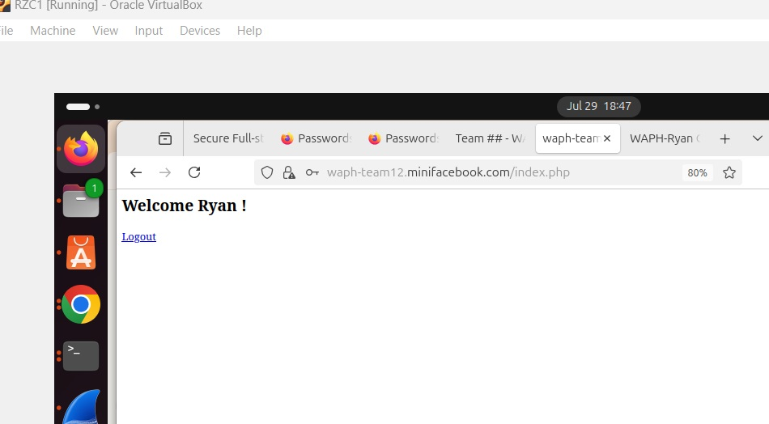
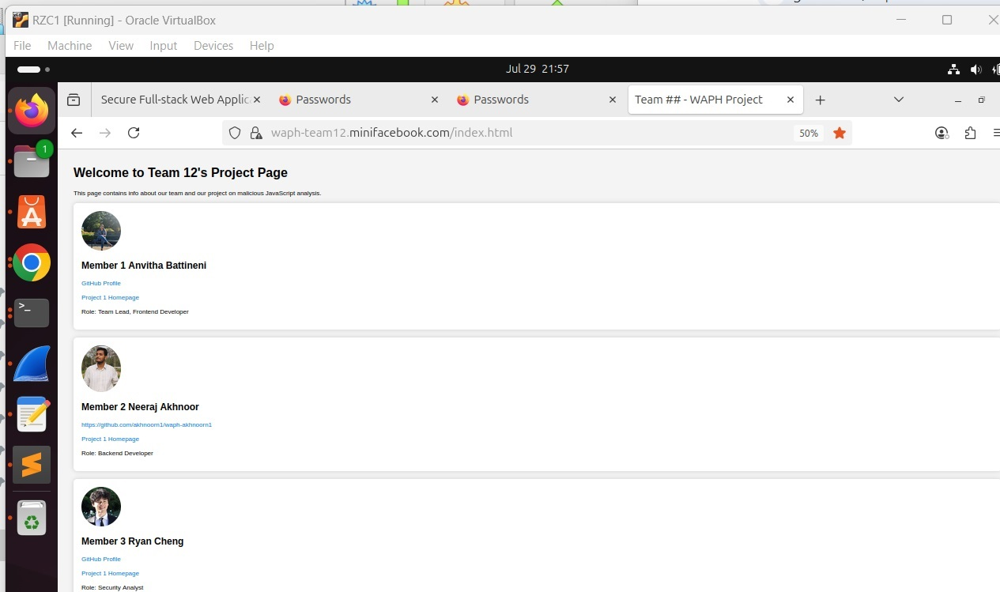

# WAPH Team Project – Sprint 0 Submission

**Team Number**: 12  
**Sprint 0 Date**: July 29, 2025  
**Project Topic**: Sprint 0

---

## Team Members

| Name               | Role                    | GitHub Username     | Personal Homepage Link                                      |
|--------------------|-------------------------|----------------------|--------------------------------------------------------------|
| Anvitha Battineni  | Team Lead, Frontend Dev | battinenia1          | [Project 1 Homepage](https://battinenia1.github.io/) |
| Neeraj Akhnoor     | Backend Developer        | akhnoorn1            | [Project 1 Homepage](https://akhnoorn1.github.io)   |
| Ryan Cheng         | Security Analyst         | 4chengr              | [Project 1 Homepage](https://4chengr.github.io)     |

---

## Completed Sprint 0 Tasks

- Configured Apache for HTTPS with domain: `https://waph-team12.minifacebook.com`
-  Configured `/etc/hosts` for local domain mapping
-  Designed and imported team MySQL database with `team12` user
-  Copied and revised Lab 3 code:
  - Integrated Lab 4 security updates
  - Database-connected login using `checklogin_mysql()`
-  Created index.html with team member details and Project 1 links
-  All pages hosted and accessible via HTTPS local domain

---

## Screenshots

### Login System Working (on HTTPS domain)

### Index Page on Team Domain

---

## Sprint 0 Contribution Summary

- **Anvitha Battineni** (Team Lead, Frontend Developer):  
  Set up team repositories, generated and configured SSL keys, implemented the HTTPS setup, and designed the `index.html` page. Coordinated all commits and finalized the login system integration.Helped test the HTTPS login flow and provided supporting screenshots.

- **Neeraj Akhnoor** (Backend Developer):  
  Created the MySQL database and user, wrote SQL scripts for schema and data, and tested PHP-MySQL login connectivity.Configured Apache for HTTPS, validated SSL placement, and reviewed the PHP login code for security. 

- **Ryan Cheng** (Security Analyst):
  Enhanced security by implementing secure session configuration, added a sample user to the database, improved the login form to include a real-time digital clock functionality and server-side timestamp display, enhanced the team's basic form by adding HTML structure, JS timing features, etc. 
  

---
