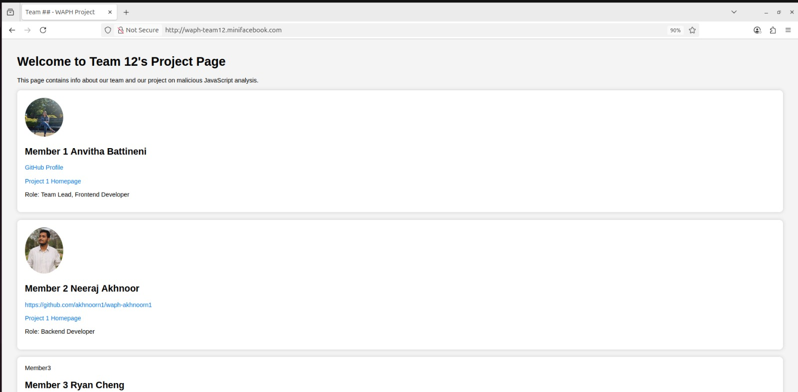

# WAPH Team Project – Sprint 0 Submission

**Team Number**: 12  
**Sprint 0 Date**: July 29, 2025  
**Project Topic**: Sprint 0

---

## Team Members

| Name               | Role                    | GitHub Username     | Personal Homepage Link                                      |
|--------------------|-------------------------|----------------------|--------------------------------------------------------------|
| Anvitha Battineni  | Team Lead, Frontend Dev | battinenia1          | [Project 1 Homepage](https://battinenia1.github.io/) |
| Neeraj Akhnoor     | Backend Developer        | akhnoorn1            | [Project 1 Homepage](https://akhnoorn1.github.io)   |
| Ryan Cheng         | Security Analyst         | 4chengr              | [Project 1 Homepage](https://4chengr.github.io)     |

---

## Completed Sprint 0 Tasks

- Configured Apache for HTTPS with domain: `https://waph-team12.minifacebook.com`
-  Configured `/etc/hosts` for local domain mapping
-  Designed and imported team MySQL database with `team12` user
-  Copied and revised Lab 3 code:
  - Integrated Lab 4 security updates
  - Database-connected login using `checklogin_mysql()`
-  Created index.html with team member details and Project 1 links
-  All pages hosted and accessible via HTTPS local domain

---

## Screenshots

### Login System Working (on HTTPS domain)

### Index Page on Team Domain

---

## Sprint 0 Contribution Summary

- **Anvitha Battineni** (Team Lead, Frontend Developer):  
  Set up team repositories, generated and configured SSL keys, implemented the HTTPS setup, and designed the `index.html` page. Coordinated all commits and finalized the login system integration.Helped test the HTTPS login flow and provided supporting screenshots.

- **Neeraj Akhnoor** (Backend Developer):  
  Created the MySQL database and user, wrote SQL scripts for schema and data, and tested PHP-MySQL login connectivity.Configured Apache for HTTPS, validated SSL placement, and reviewed the PHP login code for security. 

- **Ryan Cheng** (Security Analyst):
  Enhanced security by implementing secure session configuration, added a sample user to the database, improved the login form to include a real-time digital clock functionality and server-side timestamp display, enhanced the team's basic form by adding HTML structure, JS timing features, etc. 
  

---

# WAPH Team Project – Sprint 1 Submission

**Team Number**: 12  
**Sprint 0 Date**: August 3, 2025  
**Project Topic**: Sprint 1

Duration 07/30/2025 - 08/03/2025

Complected Tasks:

  - Created MySQL table schema for users and posts. Sample data was also inserted in the database.
  - Wrote secure user registration form with validation (registration.php).
  - Built login system with session authentication for logged-in users (session_auth.php).
  - Allowed users to change their password (changepassword.php, changepasswordform.php).
  - User can now edit their profile: name, email, and phone (editprofile.php and editprofilesuccess.php).
  - Created view posts for the logged in user (view_posts.php).
  - Structured frontend with links to all features from index.php and index.html.
  - Wrote SQL scripts to create team database (database-account.sql and database-data.sql).
  - Uploaded screenshots that show the functional pages (login, profile, registration, posts).
  - Checked host and database are working with HTTPS on Apache web server.

Contribution:

- **Anvitha Battineni** (Team Lead, Frontend Developer):  
      Member 1
        - Took lead on all the major technical development tasks, including:
        - MySQL database and schema
        - Registration and login
        - Edit profile
        - View posts
        - SQL scripts and server-side PHP integration

- **Neeraj Akhnoor** (Backend Developer): 
      Member 2 
        - Contributed to testing and project management and was partially responsible for backend development on a few specific tasks:
        - Took screenshots and documented page functionality
        - Also manually tested the flows on multiple users
        - Implemented changepasswordform.php and changepassword.php
        - Verified visual and backend integration on the password update"
        
- **Ryan Cheng** (Security Analyst):
       Member 3
        - Enhanced application security and user interface design, focusing on:
        - Added CSRF protection to registration forms with token validation
        - Implemented comprehensive input validation and sanitization
        - Added HTML5 client-side validation with pattern matching for usernames and emails
        - Reformatted and redesigned the UI to create a more professional, modern appearance
        - Enhanced form security with server-side validation and error handling
        - Implemented password confirmation matching and security best practices
    -More details on [4ChengR WaphTeam](https://github.com/4chengr/waph-teamproject/)

Sprint Retrospection:

  What went well:

    The team worked well together and balanced the technical/non-technical division of work.

    The team managed to complete tasks by the deadline and implement the main aspects of the projects (login, registration, edit profile, etc.)

    The secure database access and PHP integration was fairly smooth.

    Neeraj helped facilitate the testing and contributed screenshots for documentation which was beneficial in validating the completed sprint work.

    The change password functionality was developed collaboratively and pass the tests as defined by manual testing.

  Challenges faced:

    Some lost time early in the sprint with file organization not being clear and inconsistent form naming conventions.

    The change password logic required testing in a back-and-forth fashion because of session management concerns.

    There was some coordination involved with the technical and non-technical work streams being separate, we needed to have more sync meetings.

    There were variable commmit frequency (some members were pushing commits more often) which made it slightly harder to assess shared progress in real-time.

  Ideas for improvements for the next sprint:

    Schedule a short team-sync during the sprint to provide visibility and communication.

    Implement using standard file naming conventions and file-PHP routing as early as possible in the sprint.

    Encouraging all members to push more frequent commits would help in portions of code reviews and help to minimize merge issues.

    It would also be beneficial to start the UI layout design drafts early and break into smaller deliverables to distribute workload.

Task 1:

Task 2:

Task 3:
https://github.com/waph-ud-sm25-team12/waph-ud-sm25-team12.github.io/commit/a26f552cc5e23773f1a7e649e86be3d86b5ac068
https://github.com/waph-ud-sm25-team12/waph-ud-sm25-team12.github.io/commit/cc787dffd72e3686d4b479d42bb6b57b8d2f38e0
https://github.com/waph-ud-sm25-team12/waph-ud-sm25-team12.github.io/commit/bb50271ec7b35f6420bb4f965bb4298fee216d13
https://github.com/waph-ud-sm25-team12/waph-ud-sm25-team12.github.io/commit/68792912d96f0d69c5e414f638afabfc340b40fe
https://github.com/waph-ud-sm25-team12/waph-ud-sm25-team12.github.io/commit/e28bd6269b8feb66a01e8b06cd4bd63e58c5259d
https://github.com/waph-ud-sm25-team12/waph-ud-sm25-team12.github.io/commit/1da2f12b257294566383acfae59cadd0c497bf09
https://github.com/waph-ud-sm25-team12/waph-ud-sm25-team12.github.io/commit/423d4380a7cf3bd59fbe17cc8169ed77fac887f3
https://github.com/waph-ud-sm25-team12/waph-ud-sm25-team12.github.io/commit/4c507337ceec32983194f19b33fd0c86ddaa3558
https://github.com/waph-ud-sm25-team12/waph-ud-sm25-team12.github.io/commit/2acc848b42293f21f8a571fa28687b8be1ba0365
https://github.com/waph-ud-sm25-team12/waph-ud-sm25-team12.github.io/commit/d6cc76e23b59fdac9281561ce9855da73f5d9f62
https://github.com/waph-ud-sm25-team12/waph-ud-sm25-team12.github.io/commit/a22c234699361d51cb80d2da130b692b724034fa
https://github.com/waph-ud-sm25-team12/waph-ud-sm25-team12.github.io/commit/9ccfb5abb7456e824288e2307664984854ccf50e
https://github.com/waph-ud-sm25-team12/waph-ud-sm25-team12.github.io/commit/ed2de03a68ee662b56ddfd27ea3733ddabf01f8d
https://github.com/waph-ud-sm25-team12/waph-ud-sm25-team12.github.io/commit/293cf404f315b64ad8cbed892c9864320285f341
https://github.com/waph-ud-sm25-team12/waph-ud-sm25-team12.github.io/commit/36f473a4fd32c97e80289566051ae767821a418d
https://github.com/waph-ud-sm25-team12/waph-ud-sm25-team12.github.io/commit/a458ea5353d16eab1ba523bb9d32cdbccae97b21
https://github.com/waph-ud-sm25-team12/waph-ud-sm25-team12.github.io/commit/ad69c282b5534da86e28b53448cb1aefbafe9408
https://github.com/waph-ud-sm25-team12/waph-ud-sm25-team12.github.io/commit/41a4efee4352ee35f434f46196fa8a7bcfa159cb
https://github.com/waph-ud-sm25-team12/waph-ud-sm25-team12.github.io/commit/7553d43fff72a39535ca39021893864f95165002
https://github.com/waph-ud-sm25-team12/waph-ud-sm25-team12.github.io/commit/c873c348260f10db36701e63e9c343eef24cd9c0
https://github.com/waph-ud-sm25-team12/waph-ud-sm25-team12.github.io/commit/eb008cb76127e4e5930b2280f4dc20d2cdef5140
https://github.com/waph-ud-sm25-team12/waph-ud-sm25-team12.github.io/commit/ea2e14eccd93598527e0ff1f26ea5038b7c055b4
https://github.com/waph-ud-sm25-team12/waph-ud-sm25-team12.github.io/commit/aa40472352be51a968415e499e4c48990fcee787
https://github.com/waph-ud-sm25-team12/waph-ud-sm25-team12.github.io/commit/e335c7ccdb8a6097b422ac826aa44e6199d1a321
https://github.com/waph-ud-sm25-team12/waph-ud-sm25-team12.github.io/commit/94d833d958be63fe8f5d2f5ba82d239d0398f2c1
https://github.com/waph-ud-sm25-team12/waph-ud-sm25-team12.github.io/commit/8780886b3d080666492be7b7688faef78fab3976
https://github.com/waph-ud-sm25-team12/waph-ud-sm25-team12.github.io/commit/1ffbd5529db890a4389af6de292d99357e82b8d7
https://github.com/waph-ud-sm25-team12/waph-ud-sm25-team12.github.io/commit/7e481f0502531716249770788759a7190b8c809b
https://github.com/waph-ud-sm25-team12/waph-ud-sm25-team12.github.io/commit/96cf63b56c9dc1082bd1ab82e5ebbaf185f55814
https://github.com/waph-ud-sm25-team12/waph-ud-sm25-team12.github.io/commit/a6542e7b1b2b71d8b6d4def37500436470e0fb8d
https://github.com/waph-ud-sm25-team12/waph-ud-sm25-team12.github.io/commit/79697d61e75aa830106a389f3f0aae048460cdf1
https://github.com/waph-ud-sm25-team12/waph-ud-sm25-team12.github.io/commit/13b2aa993555d31e80e71083f25c1218578814d7
https://github.com/waph-ud-sm25-team12/waph-ud-sm25-team12.github.io/commit/376aa236cf95a39dd90c3022da407705843c2c27
https://github.com/waph-ud-sm25-team12/waph-ud-sm25-team12.github.io/commit/5833c0c1f82f34adc2853277f60bda4660748841
https://github.com/waph-ud-sm25-team12/waph-ud-sm25-team12.github.io/commit/0e8fa56bf02a8c180667926390d329faceffdc91
https://github.com/waph-ud-sm25-team12/waph-ud-sm25-team12.github.io/commit/99fc22b7778fde72ee7266fe5daa1a51423382f4
https://github.com/waph-ud-sm25-team12/waph-ud-sm25-team12.github.io/commit/f879558baff197252931d5189c8829bf46edc3f0
https://github.com/waph-ud-sm25-team12/waph-ud-sm25-team12.github.io/commit/a5c68421c6494ca367cc1a9470a0527d875d7545

Sample Images:

  The Create New Post feature allows authenticated users to share content by submitting a text-based post through a simple form interface. When a user navigates to the page, they are presented with a text area labeled "What's on your mind?" where they can enter their message. To ensure security, the form includes a CSRF token stored in the session and passed as a hidden input field, protecting against cross-site request forgery attacks. Upon submission, the form sends the data via the POST method to submit_post.php, which processes and stores the post in the database. Additionally, users have an option to return to the posts list using the Back to Posts link, maintaining easy navigation between posting and viewing content.

  The Edit Profile page allows an authenticated user to change all of their personal information stored in the system. The PHP script begins by checking to see if the user is logged in by checking for a session; if the user is not logged in, they will be redirected to the login page. Once it has made a database connection to the MySQL database, it checks to see if they are an administrator or a regular user to know which table to update (superusers or users). Once the form is completed and submitted using a POST request, the script grabs the new name, email, and phone, runs an SQL UPDATE query, and prepares statements so that SQL injection is not a consideration. If the information was successfully updated, a Java script alert will list the change and then redirect the user back to the Profile page. If the page was loaded by the GET method, the script will grab the current information in the database and pre-fill the information in the original form. It includes the function htmlentities() to protect against XSS attacks. There is also a Back to Profile link to allow the user easy navigation back to the Profile page.

  This login page for "WAPH Team 12" allows users to securely login with username and login. This login page dynamically shows the time currently and the time the login page was first visited. The login form uses POST to submit the user's credentials to index.php. It includes a CSRF token to prevent unauthorized login attempts into the form. It also provides a link for new users to register. The layout is simple and easy for user navigation, using basic HTML to layout the page with PHP to manage the session and time properties, and JavaScript to display the time live.

  This page is the profile screen for a logged in user in the mini web application. The PHP code first checks if the user is logged in via a session variable. If the user is not logged in, the PHP code redirects the user to the login form. Once the user is logged in, the code connects to a MySQL database. The code next retrieves the logged in users name, email, and telephone from the users table or the superusers table depending on if the logged in user is either a regular user or an admin user. Finally, the code creates the profile page, displaying a personalized welcome along with the user's details (name, email, and telephone number). To the right of the screen is navigation for Edit Profile, Change Password, View All Posts, and Logout buttons. In the event the user is a superuser an additional button appears for the Superuser Dashboard. The code also uses (htmlentities()) method to prevent XSS attacks as it escapes user data before outputting to screen.

  The project develops a simple user registration page for a mini web application "miniFacebook". The page is called registration.php, and presents a form for users to input their username, password, name, email address and phone number into so they can create an account. The page uses PHP to start a session, includes functions.php, and generates a CSRF token for security, which is included in the form as a hidden field. The form submits the user's entered data via the POST method to addnewuser.php to process the data. All fields must be filled in, and a link exists to go back to the login page. 

  The All Posts page lists user-generated posts pulled from the database, and shows the username and the date and time of the post. The PHP code first checks to see if the user is authenticated. If not, the user is redirected to the login form. After the database connection is completed, the post page gets posts with a join between the posts and users table, ordering the time of creation in descending order. Each post shows the username, post, and when the post was made. The username and post content are sanitized to prevent XSS attacks with the use of htmlentities() and nl2br(). The page contains links for creating a new post and to return to the profile page along with basic CSS styling for improved readability.

  The Change Password page allows the user to change their password after authentication in a secure manner, where the users also post a CSRF token to protect against attacks. There are text fields for the user to enter the old password, a new password, and to re-enter that new password to confirm they both match. All of the text fields above are required text fields, and when the user clicks on the submit button, the form data is posted to changepassword.php using a POST request. For comprehensive security, the backend web server should validate the CSRF token, verify the old password using the password_verify() function, determine that the new password matches the confirmation password and meets the complexity requirements, hash the new password securely with password_hash(), and update the database entry accordingly.

